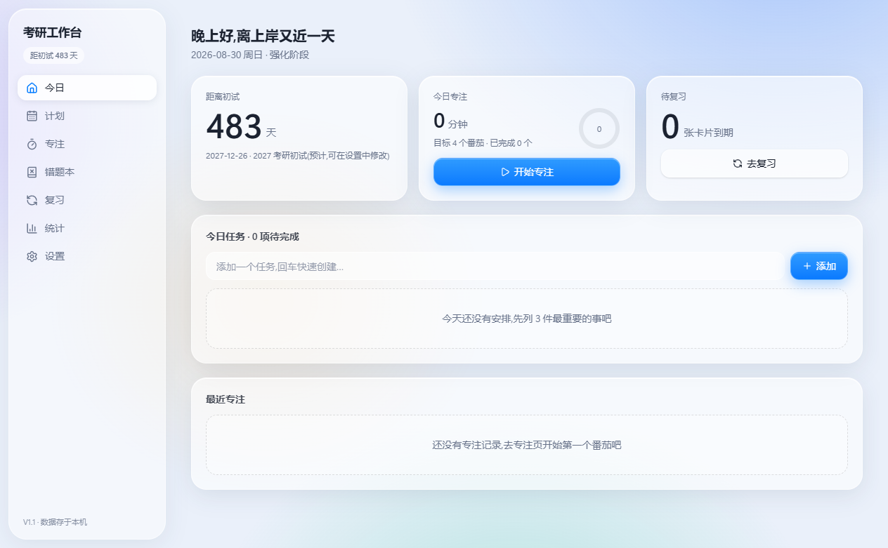
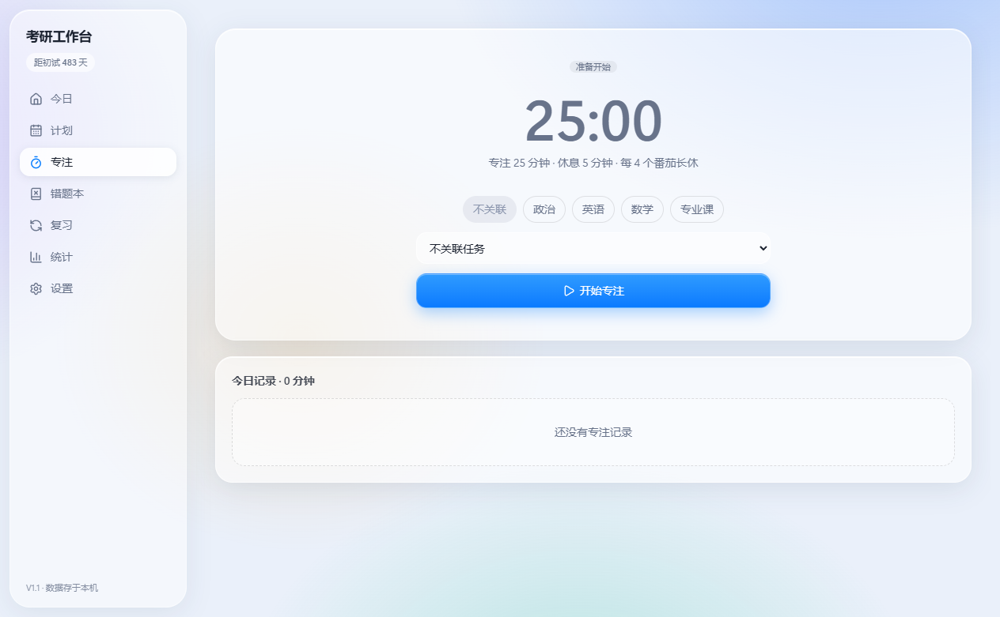
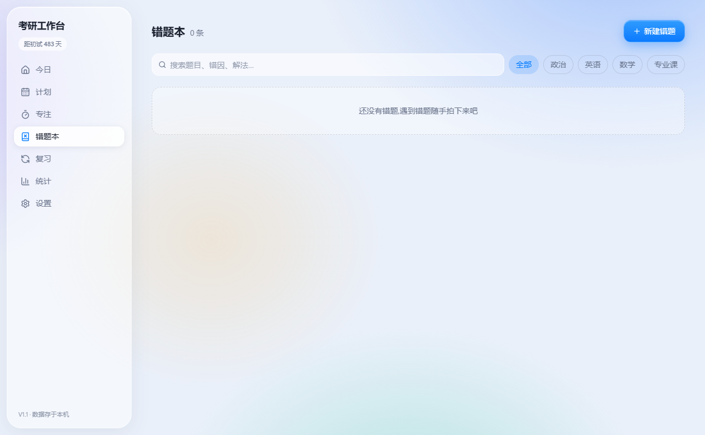

# 考研个人工作台 (KaoyanWorkbench)

单机、离线、本地数据的 Windows 桌面应用，把备考闭环装进一个窗口：

> 今天学什么（计划） → 专注多久（番茄钟） → 哪里薄弱（错题本） → 何时巩固（艾宾浩斯复习） → 效果如何（统计）。

界面采用 iOS 26「Liquid Glass」液态玻璃风格：彩色渐变壁纸打底，磨砂玻璃面板悬浮其上。







## 功能特性

- **今日**：考试倒计时、当前阶段判定、今日任务、专注概览、待复习入口，一屏总览
- **计划**：按日任务管理，重复模板（每天/工作日）自动生成当日实例，逾期任务集中改期
- **专注**：主进程番茄状态机，关窗进托盘照常计时，完成弹系统通知，每 4 个番茄长休息
- **错题本**：Ctrl+V 直接粘贴截图，掌握度跟踪，勾选即加入复习队列
- **复习**：艾宾浩斯间隔调度（记得/模糊/忘了三档反馈），与错题掌握度双向联动
- **统计**：专注时长、连续打卡、近 14 天趋势、科目分布、任务完成率
- **数据安全**：本地 JSON 原子写入（临时文件 + 替换），一键导出/导入完整备份（含截图）

## 下载安装（普通用户）

无需安装 Node.js，前往 [**Releases**](https://github.com/MingT1an/kaoyan-workbench/releases) 页面下载最新版：

- `KaoyanWorkbench-Setup-x.x.x.exe` — 安装版（推荐），含开始菜单与桌面快捷方式
- `KaoyanWorkbench-x.x.x-portable.exe` — 免安装单文件版，下载后双击即用

> 应用未做代码签名，首次运行如遇「Windows 已保护你的电脑」，点击「更多信息」→「仍要运行」即可。

## 快速开始（开发者）

要求 Node.js 18+。

```bash
git clone https://github.com/MingT1an/kaoyan-workbench.git
cd kaoyan-workbench/kaoyan-workbench
npm install

npm run dev     # 开发模式（热更新）
npm run build   # 构建
npm run start   # 运行已构建版本
npm run smoke   # 端到端启动自检
```

## 技术栈

Electron 44 · electron-vite 5 · React 19 · TypeScript 7 · Tailwind CSS 4 · lucide-react

存储层为自有 JSON 方案（零原生依赖），数据 100% 存本机（`%APPDATA%/KaoyanWorkbench`）——无账号、无网络请求、无遥测，备份即拷贝。

产品定位、交互规则与版本规划见 [产品策划案](kaoyan-workbench/docs/策划案.md)。

## 版本

- **V1.1** — 液态玻璃浅色主题（iOS 26 风格重构）、截图模式（`npm run shots`）
- **V1.0** — 七大模块整体重构：今日/计划/专注/错题本/复习/统计/设置
- **V0.1–V0.6** — 早期原型：科目与倒计时、计划任务、番茄钟、复习引擎、错题本、统计看板
